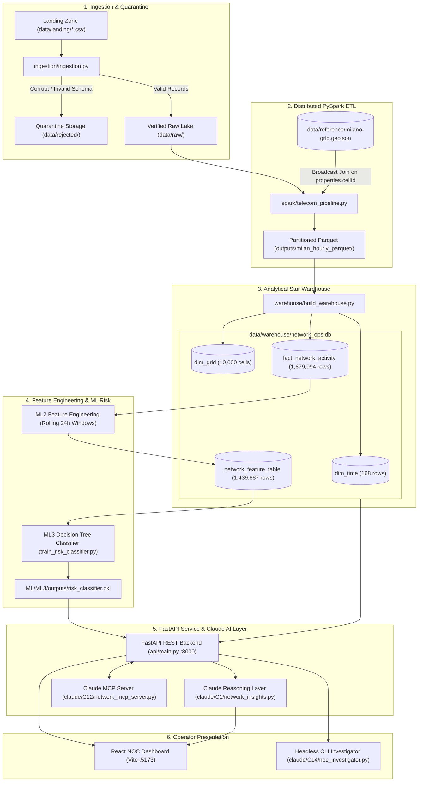
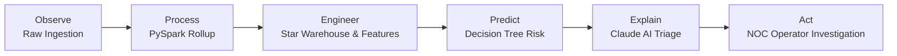
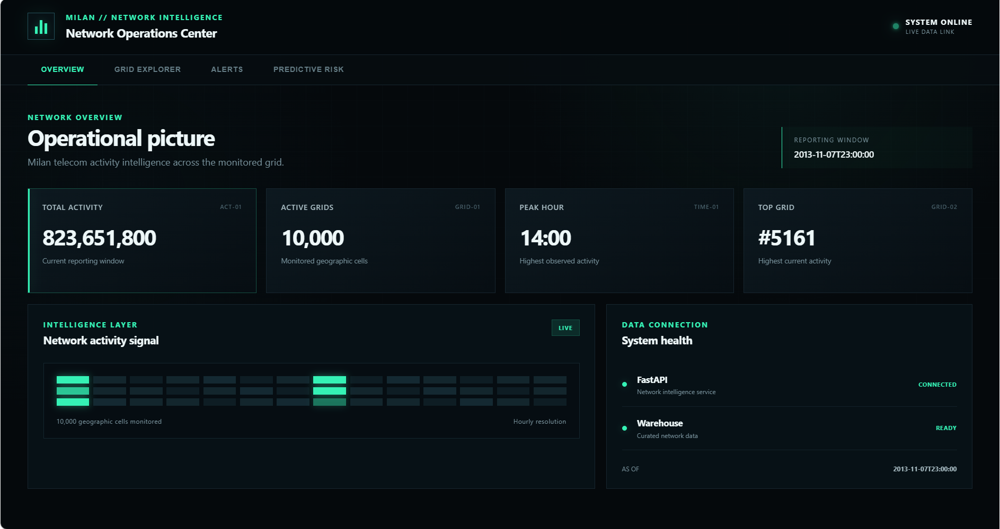
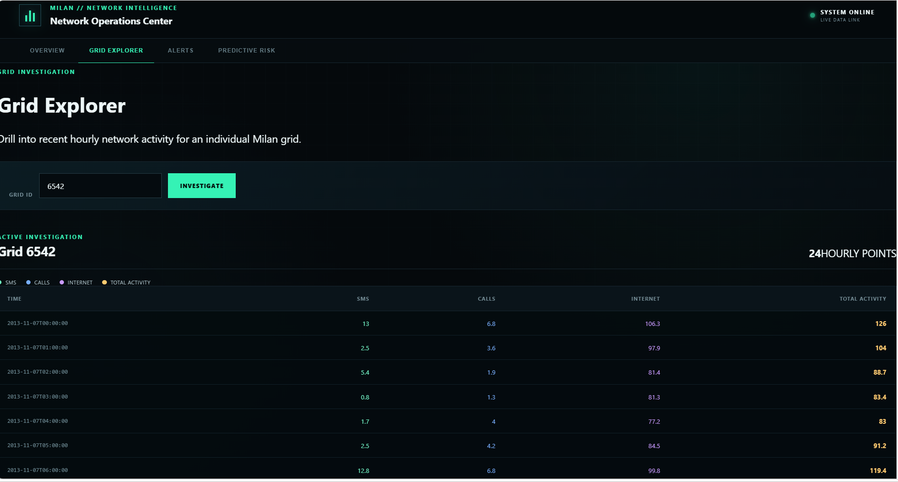
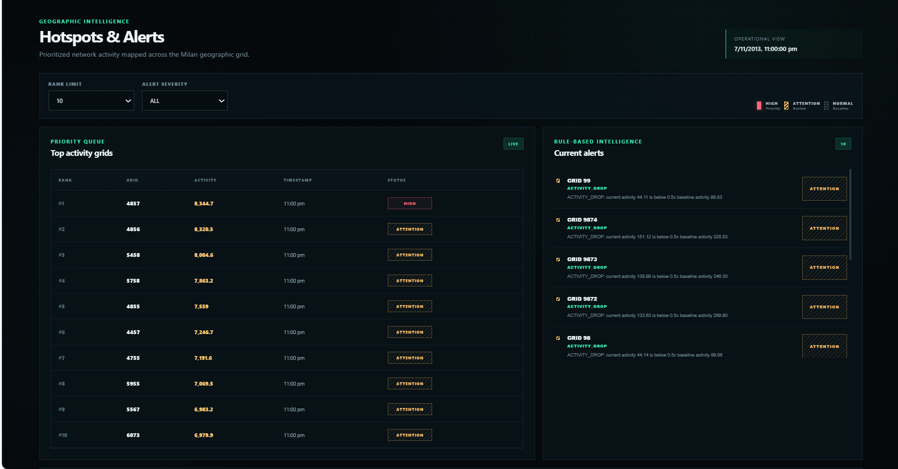
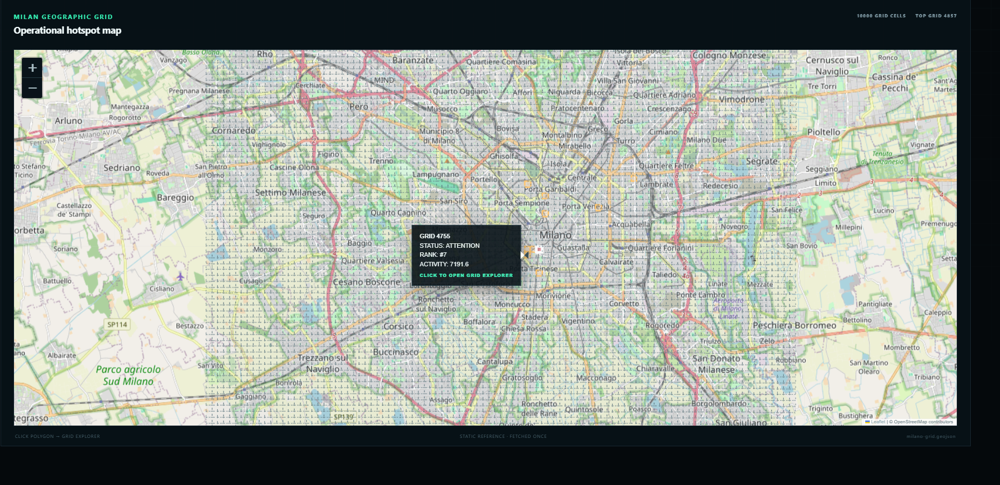
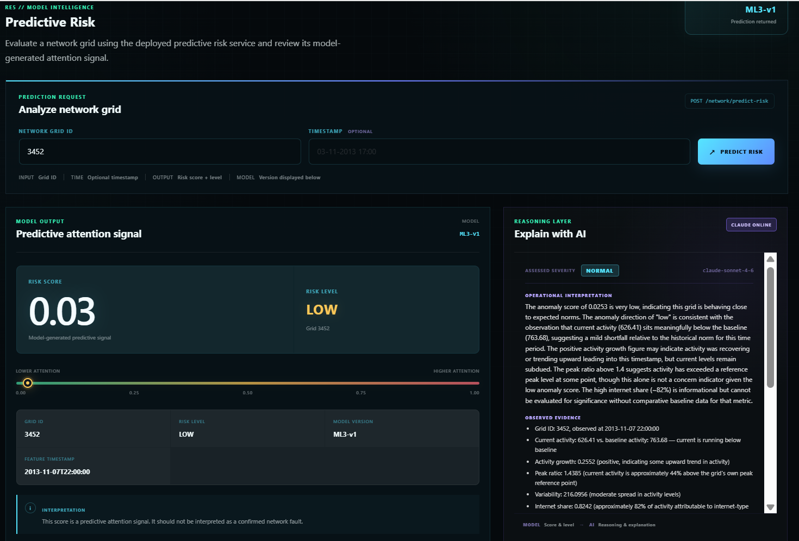
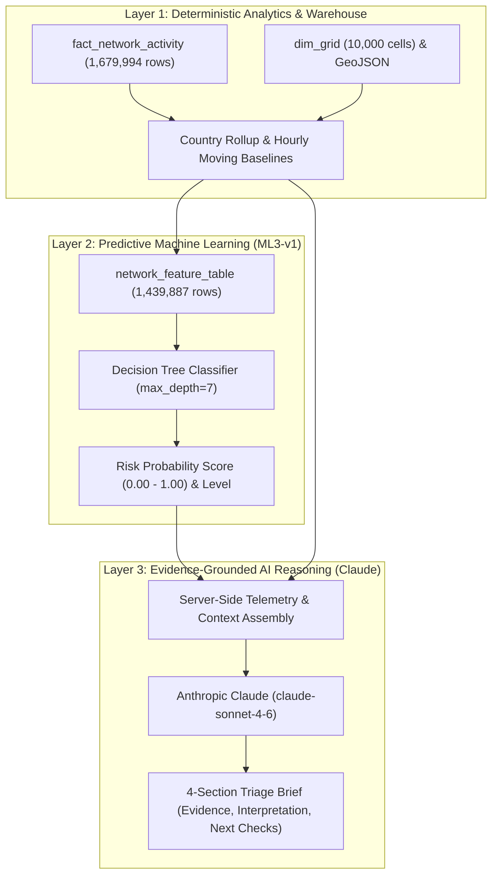
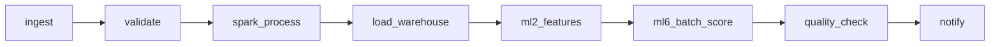

# Network Operations & Predictive Intelligence System

An end-to-end network operations intelligence platform that transforms telecommunications activity telemetry into analytical signals, predictive risk indicators, evidence-grounded AI explanations, and actionable investigation guidance.

The system operationalizes telecommunications activity data across an integrated six-stage lifecycle:

$$
\text{\bf Observe} \longrightarrow \text{\bf Process} \longrightarrow \text{\bf Engineer} \longrightarrow \text{\bf Predict} \longrightarrow \text{\bf Explain} \longrightarrow \text{\bf Act}
$$

---

## 1. Executive Summary

Modern telecommunications Network Operations Centers (NOCs) monitor large-scale telecommunications activity telemetry distributed across thousands of geographic grid cells and roaming partitions. Traditional monitoring approaches suffer from high alert fatigue, static thresholding, and an inability to provide early warning signals with grounded, evidence-based explanations.

The **Network Operations & Predictive Intelligence System** addresses these operational challenges through a cohesive, multi-layered architecture:

* **Reliable Data Engineering:** Ingests multi-country cellular activity telemetry, routes malformed records to quarantine storage, executes distributed PySpark spatial and country-code aggregations, and populates an analytical star-schema warehouse.
* **Deterministic Baseline Analytics:** Computes leave-one-out within-day median baselines, identifies spatial hotspots, and evaluates multi-rule departures to flag anomalous activity cells.
* **Leak-Free Predictive Intelligence:** Computes temporal feature vectors with zero forward leakage and deploys a constrained Decision Tree Classifier (`ML3-v1`) to forecast next-hour operational attention probabilities.
* **Evidence-Grounded AI Reasoning:** Integrates Anthropic Claude (`claude-sonnet-4-6`) directly into the backend service and React dashboard, synthesizing curated numerical telemetry into structured operational briefs with strict domain guardrails.
* **Operator Decision Support:** Delivers an interactive dark-mode NOC dashboard with dynamic Leaflet geospatial choropleths, cell-level time series exploration, and on-demand AI triage narratives.

---

## 2. Key Capabilities

| Capability                          | Operational Purpose                                                                                              | Technology Stack                                            |
| :---------------------------------- | :--------------------------------------------------------------------------------------------------------------- | :---------------------------------------------------------- |
| **Data Ingestion & Quarantine**     | Automated discovery, schema enforcement, corrupt-row trapping, and rerun idempotency.                            | Python 3.12, CSV validation, hash tracking                  |
| **Distributed Big Data Processing** | Parallel country-code aggregation and geospatial broadcast joins on Milan cell geometry.                         | PySpark 4.2.0, GeoPandas, Shapely                           |
| **Analytical Star Warehouse**       | Relational dimension and fact storage enforcing strict operational grain uniqueness and busy-timeout protection. | SQLite 3 (`dim_time`, `dim_grid`, `fact_network_activity`)  |
| **Pipeline Orchestration**          | Directed acyclic graph managing dependencies, retries, and machine-readable health telemetry.                    | Apache Airflow (`network_pipeline_dag.py`)                  |
| **Operational Service Layer**       | RESTful analytical endpoints serving aggregate KPIs, cell drill-downs, feature vectors, and ML predictions.      | FastAPI 0.110.0, Pydantic, Uvicorn                          |
| **Predictive Risk Modeling**        | Rolling temporal feature extraction and next-hour operational attention classification.                          | Scikit-learn (`DecisionTreeClassifier`, `ML3-v1`)           |
| **Evidence-Grounded AI Reasoning**  | Server-side Claude invocation synthesizing structured numerical telemetry into actionable investigation briefs.  | Anthropic Claude SDK (`claude-sonnet-4-6`), MCP tool server |
| **Interactive NOC Dashboard**       | Dark-mode operator interface with dynamic Leaflet choropleth maps, cell search, and on-demand AI explanation.    | React 18.2.0, Vite v8.2.2, Leaflet.js                       |

---

## 3. System Architecture



---

## 4. End-to-End Operational Lifecycle

The system transforms raw telecommunications records through six structured operational stages:



### 1. Observe — Raw Telemetry Ingestion

Discovers incoming telecommunications activity telemetry partitioned across international country codes. Validates column existence, numeric types, and non-negative bounds. Unparseable rows are safely routed to `data/rejected/`.

### 2. Process — Distributed Aggregation & Spatial Joins

PySpark rolls country-code records into a unified `(timestamp, grid_id)` operational grain, broadcast-joining with Milan grid GeoJSON geometries strictly on `properties.cellId` to prevent geographic indexing offsets.

### 3. Engineer — Star Schema & Leak-Free Features

Populates dimension and fact tables in SQLite. Computes rolling temporal features (`avg_activity`, `activity_growth`, `active_hours`, `peak_ratio`, `variability`, `internet_share`) strictly over historical intervals ($t-23 \dots t$) with mathematically verified zero forward leakage.

### 4. Predict — Operational Attention Classification

An interpretable Decision Tree Classifier (`ML3-v1`) evaluates current feature vectors to predict elevated activity risk in the succeeding 1-hour window ($t+1$), generating predicted risk probabilities and attention tiers (`LOW`, `MEDIUM`, `HIGH`).

### 5. Explain — Evidence-Grounded AI Triage

Curated telemetry evidence is assembled server-side and evaluated by Claude (`claude-sonnet-4-6`), returning a structured operational narrative:

1. Assessed Severity
2. Observed Evidence
3. Operational Interpretation
4. Recommended Next Checks

### 6. Act — Operator Triage & Field Investigation

The NOC engineer reviews the visual risk indicators, geographic distribution, and AI recommendations to guide external alarm reviews, adjacent cell comparisons, and temporal context verification.

*The operator remains in command; the platform guides investigation rather than executing autonomous changes.*

---

## 5. The NOC Dashboard

The React 18 operations dashboard provides a purpose-built dark-mode interface designed for telecommunications operations engineers. It translates analytical data, machine learning scores, and Claude reasoning narratives into four cohesive operational views.

### Network Overview

The **Network Overview** presents aggregate operations telemetry across the Milan network grid. It surfaces global operational KPIs (Total Activity volume, Active Grid Cells, Elevated Attention Cells, and Warehouse Data Freshness) alongside diurnal activity curves comparing current daily patterns against historical moving baselines.



* **Operational Visibility:** Displays network-wide activity indicators, peak activity hours, and data currency.
* **Diurnal Trend Analysis:** Graphs hourly activity profiles across SMS, voice call, and internet interaction channels.
* **Pipeline Status Badge:** Confirms upstream data freshness and row validation health directly from the ingestion monitoring service.

---

### Grid Exploration

The **Grid Explorer** provides deep-dive analytical investigation into individual grid cells (e.g., Grid 5161 or Grid 4821). Operators can query any cell across the 100x100 Milan tessellation to inspect hourly multi-stream activity distributions and topological context.



* **Multi-Stream Activity Breakdown:** Visualizes proportional interaction curves across SMS In/Out, Call In/Out, and Data/Internet interactions.
* **Historical Observation Table:** Displays hourly records with exact composite activity totals and internet volume share.
* **Spatial Neighbor Context:** Leverages topological centroid queries (`/network/grid/{grid_id}/neighbours`) to identify surrounding cells and evaluate localized spillover.

---

### Hotspots & Alerts

The **Hotspots & Alerts** interface combines spatial geographic mapping with deterministic rule-based anomaly detection. It renders an interactive Leaflet vector choropleth over the Milan grid cells, joined strictly on `feature.properties.cellId` to guarantee geospatial accuracy.





* **Interactive Milan Choropleth:** Color-ramps cell activity from low-intensity dark blue to elevated magenta, visually spotlighting active geographic sectors.
* **Ranked Hotspot Table:** Orders cells by total activity volume at the designated `AS_OF` reporting timestamp.
* **Deterministic Anomaly Alerts (NP3 Engine):**

  * **Daily Activity Floor:** Excludes cells below the 10th percentile of total daily network activity (`ACTIVITY_FLOOR_PERCENTILE = 0.10`) to eliminate noisy low-volume artifacts.
  * **Within-Day Leave-One-Out Baseline:** Calculates the median activity across the other 23 hours of the same day for each cell, ensuring robust local baselines.
  * **Three Rule-Based Anomaly Detectors:**

    * `HIGH_ACTIVITY`: Flags cells where current activity exceeds $1.5\times$ the within-day baseline (`HIGH_THRESHOLD = 1.5`).
    * `ACTIVITY_DROP`: Flags cells where current activity drops below $0.5\times$ the within-day baseline (`DROP_THRESHOLD = 0.5`).
    * `ACTIVITY_SPIKE`: Flags cells where current activity exceeds $2.0\times$ the preceding hour's activity (`SPIKE_THRESHOLD = 2.0`).
  * **Operational Priority Mapping:** The interface filters alerts by rule type and maps `HIGH_ACTIVITY` and `ACTIVITY_SPIKE` to `HIGH` operational priority, and `ACTIVITY_DROP` to `ATTENTION`.
* **Direct Investigation Handoff:** Clicking any cell polygon on the map or row in the alert table immediately deep-links the operator into the Grid Explorer for detailed investigation and contextual triage.

---

### Predictive Risk & AI Explanation

The **Predictive Risk** view delivers the completed **Predict → Explain** operational workflow, bringing together machine learning forecasting and Anthropic Claude qualitative reasoning in a single interface.



* **Decision Tree Risk Scoring (`ML3-v1`):** The operator enters a grid ID (e.g., Grid 4821) and optional timestamp. The model evaluates the stored ML2 feature vector to generate a predicted risk probability (0.00 to 1.00) and operational attention tier (`LOW`, `MEDIUM`, `HIGH`).
* **Interactive AI Activation:** Upon receiving a valid prediction, the interface unlocks the **EXPLAIN WITH AI** action button.
* **Integrated Claude Reasoning Layer:** Clicking the button triggers a server-side call (`POST /network/insight`), assembling curated numerical telemetry and querying `claude-sonnet-4-6`.
* **Structured Operational Brief:** Claude returns a standardized four-section report displayed directly within the UI:

  1. **Assessed Severity:** Visual severity badge (`NORMAL`, `ATTENTION`, or `HIGH`).
  2. **Operational Interpretation:** Clear, domain-grounded reasoning explaining why the cell deviated from baseline without asserting hardware failure.
  3. **Observed Evidence:** Factual numerical summary (current activity, baseline activity, growth ratio, variability, internet share, anomaly score).
  4. **Recommended Next Checks:** Concrete, actionable investigation steps for NOC engineers (e.g., verifying time-of-day expectations, reviewing relevant alarms in external management systems, comparing adjacent cells).
* **Architectural Boundary Indicator:** The bottom footer explicitly delineates model scoring from AI explanation: `MODEL Score & level → AI Reasoning & explanation`.

---

## 6. The Three Intelligence Layers

A core architectural principle of this system is the strict separation between deterministic data processing, machine learning prediction, and generative AI reasoning:



### 1. Deterministic Analytics

* Computes exact mathematical aggregates: total activity, moving means, peak ratios, and geographic centroids.
* Evaluates rule-based alert conditions: 10th-percentile daily activity floor, leave-one-out within-day median baselines, and multi-threshold anomaly rules (`HIGH_ACTIVITY`, `ACTIVITY_DROP`, `ACTIVITY_SPIKE`).
* Governed by relational database constraints and zero temporal leakage.

### 2. Predictive Machine Learning (`ML3-v1`)

* Evaluates leak-free temporal feature vectors to predict the likelihood of elevated activity in the next hour ($t+1$).
* Implements an interpretable `DecisionTreeClassifier` constrained by `criterion="entropy"`, `max_depth=7`, `min_samples_split=20`, `min_samples_leaf=10`, and `class_weight="balanced"`.
* Operates strictly as a **probabilistic attention signal**, not a confirmation of physical failure.
* Returns structured numerical outputs: predicted risk probability (0.00 to 1.00) and operational attention level (`LOW`, `MEDIUM`, `HIGH`).

### 3. Claude AI Intelligence (`claude-sonnet-4-6`)

* **Claude does not calculate risk scores, execute SQL queries, or replace ML models.**
* It receives curated numerical evidence packages and synthesizes qualitative operational context.
* Enforces strict domain guardrails: refuses to claim network congestion, translates raw numbers into operational reasoning, and suggests concrete triage procedures for human engineers.

---

## 7. Claude Intelligence & UI Integration

The Claude intelligence layer is fully integrated into the FastAPI backend service and operator dashboard. Rather than existing as an isolated script, it functions as an API-served analytical endpoint.

### End-to-End Execution Flow

```text
[React NOC Dashboard: PredictiveRisk.jsx]
         │
         │  1. Operator clicks "EXPLAIN WITH AI" for Grid 4821
         ▼
[Frontend Service: api.js -> getNetworkInsight()]
         │
         │  2. HTTP POST /network/insight {"grid_id": 4821, "timestamp": "..."}
         ▼
[FastAPI Backend: api/main.py -> network_insight()]
         │
         │  3. Gathers telemetry via api/service.py:
         │     - predict_risk()       --> risk_score: 0.0422, risk_level: "low"
         │     - get_grid_features()  --> baseline: 360.73, growth: 0.3523, peak_ratio: 1.8483
         │     - get_grid_activity()  --> current_activity: 254.97
         ▼
[Claude C1 Module: claude/C1/network_insights.py]
         │
         │  4. Formats exact C1 evidence schema:
         │     {
         │       "grid_id": 4821,
         │       "timestamp": "2013-11-07 22:00:00",
         │       "current_activity": 254.97,
         │       "baseline_activity": 360.73,
         │       "activity_growth": 0.3523,
         │       "peak_ratio": 1.8483,
         │       "variability": 147.18,
         │       "internet_share": 0.828,
         │       "anomaly_score": 0.0422,
         │       "anomaly_direction": "low"
         │     }
         │  5. Invokes Anthropic API (claude-sonnet-4-6) server-side
         │     Enforces CLAUDE.md Rule #4 (No Congestion Claims)
         ▼
[FastAPI Response: NetworkInsightResponse]
         │
         │  6. Returns HTTP 200 JSON with severity, markdown narrative, and evidence dict
         ▼
[React NOC Dashboard: PredictiveRisk.jsx]
         │
         7. Renders 4-section operational brief with severity badge and re-analysis options
```

### Claude Engineering Modules (C1–C16)

The repository organizes Claude capabilities into focused operational modules:

* **C1 — Network Insight Generator:** Generates structured four-section operational narratives (Severity, Observed Evidence, Operational Interpretation, Recommended Next Checks) from curated telemetry evidence. Reused directly by the FastAPI `/network/insight` endpoint.
* **C2 — Operations Assistant:** Provides conversational access to selected network and pipeline tools (`get_pipeline_status`, `get_network_summary`).
* **C3 — Investigation Context:** Curates relevant operational metrics and cell history for incident investigation workflows.
* **C4 — Domain Guardrails:** Programmatically enforces project terminology and prevents unsupported congestion or hardware failure claims.
* **C6 — Permissions & Safeguards:** Applies command and filesystem access boundaries to protect configuration and data assets.
* **C7 — NOC Commands:** Provides structured slash commands (`/check-pipeline`, `/explain-grid`, `/review-anomaly`, `/test-api`, `/network-health`) for recurring operations tasks.
* **C9 — Task Coordination:** Coordinates specialized analytical roles (Ingestion, Anomaly, Spatial, Governance) and captures consensus and dissenting findings.
* **C12 — MCP Tool Server:** Exposes selected analytical capabilities via a Model Context Protocol tool server (`claude/C12/network_mcp_server.py`).
* **C13 — Team Plugin:** Validates project tool definitions, prompts, and operational standards.
* **C14 — CLI Investigator:** Provides a headless command-line investigation workflow (`noc_investigator.py --grid-id <ID>`) outputting structured JSON briefs.
* **C16 — Context Compaction:** Filters and compacts operational records before prompt construction to minimize unnecessary tokens.

---

## 8. Data Engineering & Analytical Warehouse

### Canonical Grains

* **Raw Landing Grain:** Multiple records per grid cell per hour, disaggregated by international country code:

  $$
  \text{Raw Grain} = (\text{timestamp}, \text{grid\_id}, \text{country\_code})
  $$

* **Analytics Warehouse Grain:** Exactly one record per grid cell per hour after summing international activity:

  $$
  \text{Analytics Grain} = (\text{timestamp}, \text{grid\_id})
  $$

* **ML Feature Grain:** One record per grid cell per valid feature hour, anchored strictly to historical observations:

  $$
  \text{Feature Grain} = (\text{grid\_id}, \text{feature\_timestamp})
  $$

### Star Schema Architecture & Verified Row Counts

The SQLite analytical warehouse (`data/warehouse/network_ops.db`) is structured as an analytical star schema:

| Table Name              | Schema Type      | Verified Row Count | Key Columns                                                                      | Operational Description                                                     |
| :---------------------- | :--------------- | :----------------: | :------------------------------------------------------------------------------- | :-------------------------------------------------------------------------- |
| `dim_time`              | Dimension        |         168        | `time_key` (PK), `timestamp`, `hour`, `day_of_week`                              | 7 full days of hourly timestamps (2013-11-01 00:00 to 2013-11-07 23:00).    |
| `dim_grid`              | Dimension        |       10,000       | `grid_key` (PK), `grid_id`, `centroid_latitude`, `centroid_longitude`            | 100x100 spatial grid cells covering the Milan metropolitan area.            |
| `fact_network_activity` | Fact Table       |      1,679,994     | `time_key` (FK), `grid_key` (FK), `total_activity`, `internet_share`             | Cleaned hourly activity metrics; strictly unique on `(time_key, grid_key)`. |
| `network_feature_table` | ML Feature Store |      1,439,887     | `grid_id`, `feature_timestamp`, `avg_activity`, `activity_growth`, `variability` | Rolling 24-hour backward feature matrix with zero forward leakage.          |

#### Mathematical Row-Count Alignment

* `fact_network_activity` contains **1,679,994 rows** ($10,000 \text{ cells} \times 168 \text{ hours} = 1,680,000$, minus 6 missing grid-hours in raw data).
* `network_feature_table` contains **1,439,887 rows**:

  * The first 23 hours (`2013-11-01 00:00` to `22:00`) are consumed by the rolling 24-hour window burn-in (`min_periods=24`).
  * The final hour (`2013-11-07 23:00`) is excluded by the $t+1$ prediction horizon requirement (`has_valid_next_hour`).
  * Exactly 144 feature hours remain ($144 \times 10,000 = 1,440,000$, minus 113 missing grid-hour observations across historical windows).

### Pipeline Orchestration (Apache Airflow)

The data lifecycle is orchestrated via Apache Airflow (`airflow/dags/network_pipeline_dag.py`):



1. `ingest`: Discovers incoming CSV batches in `data/landing/` and routes malformed records to `data/rejected/`.
2. `validate`: Asserts required columns, non-negative bounds, and schema integrity.
3. `spark_process`: Executes `spark/telecom_pipeline.py` to aggregate country codes and export partitioned Parquet.
4. `load_warehouse`: Executes `warehouse/build_warehouse.py` to populate SQLite star tables with index creation.
5. `ml2_features`: Executes `ML/ML2/feature_engineering.py` to update rolling 24-hour feature vectors.
6. `ml6_batch_score`: Executes `ML/ML6/batch_score.py` to score cells and generate operational attention reports.
7. `quality_check`: Asserts zero duplicate `(time_key, grid_key)` records and foreign-key integrity in SQLite.
8. `notify`: Writes `logs/pipeline_status.json` with execution latency, row counts, and data freshness metrics.

---

## 9. Machine Learning Pipeline

### Prediction Problem Definition

The predictive model forecasts whether an individual grid cell will experience an elevated activity condition in the succeeding 1-hour interval ($t+1$), based exclusively on observations available through the current time $t$:

$$
\text{feature\_timestamp} = t \quad\longrightarrow\quad \text{prediction\_horizon} = t+1
$$

* **Synthetic Proxy Target Definition:** Binary training target derived from next-hour activity behavior using the project's defined historical baseline rule:

  $$
  \text{target} =
  \begin{cases}
  1 & \text{if } \text{total\_activity}(t+1) > 1.5 \times \text{prior\_24h\_baseline}(t) \\
  0 & \text{otherwise}
  \end{cases}
  $$

  where:

  $$
  \text{prior\_24h\_baseline}(t) =
  \text{median}(\text{total\_activity}_{t-23 \dots t})
  $$

* **Proxy Nature & Domain Scope:** This target is a **synthetic proxy label** constructed from available activity measures for model training and evaluation. It is not a ground-truth operational fault or failure label. The underlying dataset does not contain verified ground-truth labels for network faults, congestion, hardware failures, packet loss, or service outages. A positive target signifies solely that the cell is projected to exhibit elevated activity relative to its recent baseline, functioning as an **operational attention signal** to prioritize engineering review.

### Feature Extraction & Leakage Prevention

Features are constructed strictly from backward-looking windows ($t-23 \dots t$):

* `avg_activity`: 24-hour rolling arithmetic mean.
* `activity_growth`: Percentage change between recent 6-hour mean ($t-5 \dots t$) and prior 24-hour baseline ($t-29 \dots t-6$).
* `active_hours`: Count of hours with non-zero activity in the past 24 hours.
* `peak_ratio`: Ratio of the maximum activity in the past 24 hours to the 24-hour mean.
* `variability`: Population standard deviation ($\sigma$) over the 24-hour window.
* `internet_share`: Proportion of total activity attributed to internet interactions.

#### Temporal Leakage Verification

The project includes an automated regression test (`ML/ML2/test_feature_engineering.py`) that injects extreme artificial activity spikes ($10,000\times$) at future timestamps $t+1 \dots t+6$. The recomputed feature vector at timestamp $t$ demonstrates **zero delta ($0.000000$)** across all features, proving complete mathematical isolation.

### Model Implementation

* **Model Type:** Interpretable `DecisionTreeClassifier` (`criterion="entropy"`, `max_depth=7`, `min_samples_split=20`, `min_samples_leaf=10`, `class_weight="balanced"`, `random_state=42`).
* **Model Version:** `ML3-v1`
* **Artifact Path:** `ML/ML3/outputs/risk_classifier.pkl` (served on demand by FastAPI).
* **Serving Thresholds:** Predictions return an uncalibrated risk probability mapped to operational attention tiers:

  * `HIGH`: Probability $\ge 0.80`
  * `MEDIUM`: Probability $\ge 0.40` and $< 0.80$
  * `LOW`: Probability $< 0.40`

---

## 10. Operational API Surface

The FastAPI backend (`api/main.py`) provides 10 RESTful endpoints backed by read-only connection pooling against the analytics warehouse:

| Endpoint                             | Method | Response Model           | Description                                                                                                  |
| :----------------------------------- | :----: | :----------------------- | :----------------------------------------------------------------------------------------------------------- |
| `/network/summary`                   |  `GET` | `NetworkSummaryResponse` | Global KPIs: total activity, active cells (10,000), peak hour, and `as_of`.                                  |
| `/network/grid/{grid_id}`            |  `GET` | `GridActivityResponse`   | 24-hour historical time series partitioned into SMS, voice calls, and internet.                              |
| `/network/hotspots`                  |  `GET` | `HotspotResponse`        | Top N cells ranked by total activity at a specified `as_of` timestamp.                                       |
| `/network/alerts`                    |  `GET` | `AlertResponse`          | Active rule-based anomaly flags filtered by alert type (`HIGH_ACTIVITY`, `ACTIVITY_DROP`, `ACTIVITY_SPIKE`). |
| `/network/grid/{grid_id}/features`   |  `GET` | `GridFeatureResponse`    | Stored ML2 feature vector (`avg_activity`, `activity_growth`, `variability`).                                |
| `/network/predict-risk`              | `POST` | `PredictionResponse`     | On-demand Decision Tree inference returning probability and attention tier.                                  |
| `/network/insight`                   | `POST` | `NetworkInsightResponse` | Curated evidence synthesis invoking Claude reasoning for structured operational triage.                      |
| `/pipeline/status`                   |  `GET` | `PipelineStatusResponse` | Ingestion status, processed row counts, and warehouse data freshness.                                        |
| `/network/grid/{grid_id}/location`   |  `GET` | `GridLocationResponse`   | Centroid coordinates and geometry reference for spatial mapping.                                             |
| `/network/grid/{grid_id}/neighbours` |  `GET` | `GridNeighboursResponse` | Topological 8-neighbor cells for surrounding spatial spillover analysis.                                     |

### The `/network/insight` Contract

#### Request

```json
{
  "grid_id": 4821,
  "timestamp": "2013-11-07T22:00:00"
}
```

`timestamp` is optional and defaults to the latest feature timestamp.

#### Response

```json
{
  "grid_id": "4821",
  "feature_timestamp": "2013-11-07T22:00:00",
  "severity": "NORMAL",
  "insight": "SEVERITY\nNORMAL\n\nEVIDENCE\n- Grid ID: 4821...\n\nINTERPRETATION\n...\n\nNEXT CHECKS\n1. ...",
  "evidence": {
    "grid_id": 4821,
    "timestamp": "2013-11-07 22:00:00",
    "current_activity": 254.97,
    "baseline_activity": 360.73,
    "activity_growth": 0.3523,
    "peak_ratio": 1.8483,
    "variability": 147.18,
    "internet_share": 0.828,
    "anomaly_score": 0.0422,
    "anomaly_direction": "low"
  },
  "model_version": "claude-sonnet-4-6"
}
```

---

## 11. Technology Stack

### Data Processing & Storage

* Python 3.12 — Core Ingestion, Data Quality, Feature Engineering
* Apache Spark 4.2.0 / PySpark — Distributed Spatial ETL & Parquet Export
* SQLite 3 — Analytical Star Schema Warehouse
* Snappy Parquet — Intermediate Partitioned Lake

### Backend & Machine Learning

* FastAPI 0.110.0 — High-Performance RESTful Microservice
* Pydantic v2 — Strict Schema Validation & Serialization
* Scikit-learn 1.9.0 — Decision Tree Classifier `ML3-v1`
* Uvicorn — ASGI Server

### AI & Reasoning

* Anthropic Claude Python SDK — Model: `claude-sonnet-4-6`
* Model Context Protocol (MCP) Tool Server

### Frontend & Visualization

* React 18.2.0 — Component Architecture
* Vite v8.2.2 — Build Tooling & Fast HMR
* Leaflet.js & React-Leaflet — Geospatial Vector Choropleths

### Orchestration & Quality

* Apache Airflow — Directed Acyclic Graph Pipeline Workflow
* Unittest & Pytest — Automated Regression & Ingestion Test Suites

---

## 12. Project Structure

```text
Network Operations Predictive System/
├── CLAUDE.md                            # Claude project rules, grain contracts & guardrails
├── README.md                            # Comprehensive evaluator documentation
├── airflow/                             # Apache Airflow orchestration (DE7)
│   └── dags/
│       └── network_pipeline_dag.py      # Master DAG orchestrating ingest to ML batch scoring
├── api/                                 # FastAPI REST backend service layer (API1-API6)
│   ├── database.py                      # Read-only SQLite connection provider
│   ├── main.py                          # FastAPI application entrypoint, CORS, routers
│   ├── models.py                        # Pydantic request and response schema models
│   ├── service.py                       # Analytical SQL queries and ML inference serving
│   ├── test_api1.py                     # Unit test suite for /network/summary
│   └── test_api2.py                     # Unit test suite for /network/grid/{id}
├── claude/                              # Claude Engineering Modules (C1-C16)
│   ├── C1/ (network_insights.py)        # Incident narrative generator (reused by FastAPI)
│   ├── C2/ (operations_assistant.py)    # Operations assistant with tool access
│   ├── C3/ (incident_investigation.py)  # Context-curated investigation workflow
│   ├── C4/ (repository_understanding)   # CLAUDE.md rule audit & Rule #4 enforcement
│   ├── C6/ (permissions_security.py)    # Security boundary & command permission manager
│   ├── C7/ (slash_commands.py)          # Custom NOC slash command parser & executor
│   ├── C9/ (subagent_orchestration.py)  # Multi-role task coordination
│   ├── C12/ (network_mcp_server.py)     # Model Context Protocol (MCP) tool server
│   ├── C13/ (team_plugin.py)            # Team plugin manifest & validation engine
│   └── C14/ (noc_investigator.py)       # Headless CLI incident investigation tool
├── data/
│   ├── landing/                         # Incoming raw CSV batch drops
│   ├── raw/                             # Validated raw activity records
│   ├── rejected/                        # Corrupt or unparseable records quarantine
│   ├── reference/                       # Geospatial reference (milano-grid.geojson)
│   └── warehouse/
│       └── network_ops.db               # SQLite analytical star-schema warehouse
├── frontend/                            # React 18 / Vite NOC dashboard (RE1-RE5)
│   ├── src/
│   │   ├── App.jsx                      # Navigation shell and overview view
│   │   ├── pages/                       # View components (GridExplorer, HotspotsAlerts, PredictiveRisk)
│   │   └── services/                    # API client layer (Fetch / Axios)
│   ├── package.json                     # NPM dependency manifest
│   └── vite.config.js                   # Vite configuration
├── ingestion/                           # Ingestion pipeline scripts & status (DE1-DE2)
│   ├── ingestion.py                     # Schema validation, quarantine routing, idempotency
│   └── pipeline_status.json             # Machine-readable pipeline health artifact
├── ML/                                  # Machine Learning Pipeline (ML1-ML6)
│   ├── ML1.md                            # Proxy operational attention target definition
│   ├── ML2/ (feature_engineering.py)    # Leak-free rolling temporal feature extraction
│   │   └── test_feature_engineering.py  # Temporal leakage regression test
│   ├── ML3/ (train_risk_classifier.py)  # Decision Tree model training & serialization
│   │   └── outputs/ (risk_classifier)   # Serialized model artifact (.pkl) & metrics (.json)
│   └── ML6/ (batch_score.py)            # High-throughput batch scoring & Top-20 report
├── screenshots/                          # Real application interface captures
│   ├── overview.png                      # Network Overview dashboard view
│   ├── grid_explorer.png                 # Grid Explorer activity view
│   ├── alerts1.png                       # Hotspots and Alerts vector choropleth
│   ├── alerts2.png                       # Alert investigation and detail table
│   └── predictive_risk.png               # Predictive Risk & Claude AI explanation
├── spark/                                # PySpark distributed ETL pipeline (SP7)
│   └── telecom_pipeline.py               # Master Spark pipeline (aggregation & GeoJSON join)
└── tests/                                # Automated data engineering unit tests
    └── test_ingestion.py                 # DE1/DE2 automated ingestion test suite (7 tests)
```

---

## 13. Quality & Validation Verification

All core subsystems undergo automated verification to prove functional correctness and architectural compliance:

| Test Suite / Component                | Verification Command                           |  Status  | Scope & Proof                                                                               |
| :------------------------------------ | :--------------------------------------------- | :------: | :------------------------------------------------------------------------------------------ |
| **Network Summary API (API1)**        | `python api/test_api1.py`                      | **PASS** | Asserts global aggregate metrics, ISO timestamps, and HTTP 200 contract.                    |
| **Grid Activity History API (API2)**  | `python api/test_api2.py`                      | **PASS** | Validates 24h history bounds, non-negative interaction measures, and 404 handling.          |
| **Data Ingestion & Quarantine (DE)**  | `python -m unittest tests/test_ingestion.py`   | **PASS** | 7/7 tests pass: schema validation, corrupt line quarantine, and rerun idempotency.          |
| **ML Forward Temporal Leakage (ML2)** | `python ML/ML2/test_feature_engineering.py`    | **PASS** | Proves mathematical 0.000000 delta after future activity spike injection ($t+1 \dots t+6$). |
| **Claude Team Plugin & Guardrails**   | `python claude/C13/team_plugin.py`             | **PASS** | Verifies clean workspace installation, slash commands, and Rule #4 enforcement.             |
| **Rule #4 Congestion Guardrail**      | `python claude/C4/repository_understanding.py` | **PASS** | Confirms programmatic refusal to infer congestion from non-capacity telemetry.              |
| **Frontend Build**                    | `npm run build` (in `frontend/`)               | **PASS** | Vite transforms 64 modules with 0 errors in under 700ms.                                    |
| **Live Claude Insight Endpoint**      | `POST /network/insight`                        | **PASS** | HTTP 200 OK returning assessed severity, structured evidence, and Claude brief.             |

---

## 14. Getting Started

### Prerequisites

* **Python:** 3.12.x (`.python-version` configured for 3.12)
* **Node.js:** v20+ and npm 10+
* **Java:** Java 8, 11, or 17 (required for Apache Spark operations)
* **Anthropic API Key:** Required for live Claude reasoning calls (configured in `.env`).

### Fast Verification (< 2 Minutes)

To verify the core backend, database, and machine learning components without starting servers:

```bash
# 1. Activate virtual environment
.\venv\Scripts\activate          # Windows
source venv/bin/activate         # Linux / macOS

# 2. Run core unit and regression test suites
python -m unittest api/test_api1.py api/test_api2.py tests/test_ingestion.py
python ML/ML2/test_feature_engineering.py
```

### Running the Full System

#### 1. Configure Environment

Create a `.env` file at the project root:

```env
ANTHROPIC_API_KEY=your-actual-anthropic-key-here
ANTHROPIC_MODEL=claude-sonnet-4-6
```

#### 2. Start FastAPI REST Backend

```bash
uvicorn api.main:app --host 127.0.0.1 --port 8000 --reload
```

* Interactive Swagger API Documentation: `http://127.0.0.1:8000/docs`
* Network Summary Endpoint: `http://127.0.0.1:8000/network/summary`
* Predictive Risk Endpoint: `http://127.0.0.1:8000/network/predict-risk`
* Claude Insight Endpoint: `http://127.0.0.1:8000/network/insight`

#### 3. Start React NOC Dashboard

In a separate terminal:

```bash
cd frontend
npm install
npm run dev
```

* Operator Interface: `http://localhost:5173`

#### 4. Run Headless CLI Investigation Tool

```bash
python claude/C14/noc_investigator.py --grid-id 4821
```

---

## 15. Design Principles & Domain Guardrails

To preserve strict domain validity, all components adhere to the project data contract.

### 1. Activity Measures $\neq$ Physical Network Capacity

* Telemetry records contain proportional interaction activity indices: `sms_in`, `sms_out`, `call_in`, `call_out`, `internet_activity`.
* Activity values are **unitless proportional measures**, NOT literal message tallies and NOT megabytes, gigabytes, or physical throughput.
* Composite activity is calculated as:

  $$
  \text{total\_activity} =
  \text{total\_sms} +
  \text{total\_calls} +
  \text{internet\_activity}
  $$

### 2. No Congestion Claims

* The Milan dataset tracks interaction volume, but contains **no network capacity, bandwidth, latency, packet drop rate, or radio frequency utilization metrics**.
* Therefore, the system **never asserts or claims network congestion**.
* High activity values or ML predictions represent **operational attention signals** warranting verification, not confirmed network failures.

### 3. Spatial Joins on `properties.cellId`

* Geospatial joins with `data/reference/milano-grid.geojson` must strictly match on `feature.properties.cellId`.
* Joining on the zero-based GeoJSON array index `id` introduces a systematic geographic offset and is strictly prohibited.

### 4. The `AS_OF` Temporal Convention

* The system operates over historical batch intervals where "now" is defined by the `AS_OF` parameter.
* All rolling baselines, feature windows, and hotspot queries calculate temporal windows strictly relative to `AS_OF`, excluding any observations timestamped $> \text{AS_OF}$ to prevent data leakage.

### 5. Operator-in-the-Loop Triage

* Claude provides **investigation guidance and next checks**, not autonomous remediation.
* The system does not attempt autonomous network configuration changes, respecting established telecommunications engineering change-control principles.

---

## 16. Boundaries & Future Scope

### Current Project Boundaries

* **Demand-Side Observability:** The platform monitors user interaction volume rather than physical radio frequency telemetry (e.g., CQI, RSRP, SINR).
* **Attention Signaling:** Classifications indicate cells exhibiting severe statistical departures from baseline, serving as triage triggers for human engineers rather than automated alarm tickets.
* **Geographic Coverage:** Optimized for the 100x100 grid tessellation of the Milan metropolitan area (Grid IDs 1–10,000).

### Future Capabilities

* **Multi-Metropolitan Scaling:** Extending ingestion templates to additional provincial and national grid topologies.
* **Streaming Telemetry Ingestion:** Introducing Apache Kafka and Apache Flink for sub-minute streaming aggregations.
* **ITSM Integration:** Automated bidirectional ticket generation (e.g., ServiceNow, Jira Service Management) linking Claude operational briefs directly to field technician work orders.

---

## 17. Summary

The **Network Operations & Predictive Intelligence System** establishes a disciplined, end-to-end framework bridging distributed big data engineering, analytical warehousing, leak-free machine learning, and evidence-grounded AI reasoning workflows. By translating raw telecommunications activity records through the rigorous paradigm of **Observe → Process → Engineer → Predict → Explain → Act**, the platform delivers reliable, explainable, and actionable intelligence for modern network operations.
